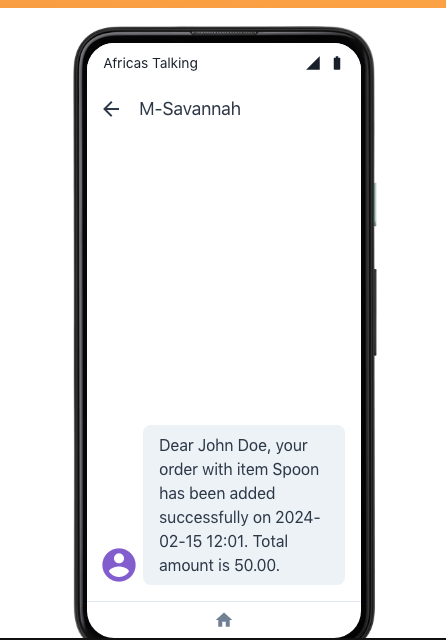

# Project Description
Django RESTful API featuring OpenID Connect Authentication. Developed a database management system for customers and orders. Users to seamlessly create customers, obtain unique customer IDs, and initiate order creation. Customers can effortlessly place orders and receive instant confirmation messages, ensuring a smooth and efficient process.

## Technologies Used
- Framework: Python Django with Django Rest Framework
- Database: PostgreSQL
- Authentication: OIDC Oauth2 authentication using Django and mozilla-django-oidc with Okta
- Africa’s Talking SMS Gateway

## Getting Started

### Instructions on how to set up and run the project locally.
```
git clone https://github.com/rkipchumba/Savannah-Backend-Test
cd Savannah-Backend-Test
```

- Create Virtual Environment
```
python -m venv venv
source venv/bin/activate
```

- Install Dependencies
```
pip install -r requirements.txt
```

- Database Configuration
Update the database settings in `settings.py` with your PostgreSQL credentials
```
Apply Migrations:- 
python manage.py migrate
```

- Create Superuser for admin access
```
python manage.py createsuperuser
```
- Google OAuth2 Configuration:
Set up the Google Okta credentials in your project's settings

- Run the Server
```
python manage.py runserver
```

- Access the Application
```
http://127.0.0.1:8000/swagger
```
- Testing
Django's testing framework that makes it easy to create and 
run tests was implemented. 
The coverage package is used to measure code coverage
```
python manage.py test
```
For a nicer presentation, use `coverage html` Then open htmlcov/index.html in your browser, to see a report.


## API Endpoints

### Create a New Customer
- Method: POST
- Endpoint: http://127.0.0.1:8000/api/Customers/
```
Request Body: JSON object with order details
Headers: [{"key":"Content-Type","value":"application/json"]
sample Body
{
  "name": "John Doe",
  "code": "JD001", 
  "phone_number": "string"
}
```

### Create a New Order
- Method: POST
- Endpoint: http://127.0.0.1:8000/api/orders/
```
Request Body: JSON object with customer details
Headers: [{"key":"Content-Type","value":"application/json"]
sample Body
{
  "customer": 0,
  "item": "string",
  "amount": "string"
}
```


### Retrieve List of Customers
- Method: GET
- Endpoint: http://127.0.0.1:8000/api/customers/

### Retrieve List of Orders
- Method: GET
- Endpoint: http://127.0.0.1:8000/api/orders/

### Retrieve Single Customer
- Method: GET
- Endpoint: http://127.0.0.1:8000/api/<customer_id>/

### Retrieve Single Order 
- Method: GET
- Endpoint: http://127.0.0.1:8000/api/<order_id>/

## SMS Integration

 When an order is added, the customer receives an SMS alerting them they
 have placed an order from M-Savannah (custom sender ID ).
 I used the Africa’s Talking SMS gateway and sandbox. Set up USERNAME and API_KEY
`https://developers.africastalking.com/`




## Authentication and Authorization

---
> > OIDC authentication with Django and Okta
--- 

1. OpenID Connect (OIDC) is a protocol that allows a user to authenticate with a third-party service and then use that authentication to sign in to other services. OIDC is built on top of the OAuth2 protocol and adds an additional layer of authentication on top of it. This allows a user to not only grant permission for a service to access their data, but also to verify their identity.

2. Okta is an identity and access management platform that enables organizations to securely connect users to technology. It supports the OIDC protocol, which allows users to be authenticated and receive information about their identity and access rights across different applications.

3. ### Okta Customer Identity Cloud

For seamless identity management and authentication create an app  using the [Okta Customer Identity Cloud](https://auth0.com/signup?utm_medium=referral&utm_source=okta&utm_campaign=okta-signup-referral-21-09-27&utm_content=signup&promo=sup&ocid=7014z000001cbvjAAA-aPA4z0000008OZeGAM&_gl=1*mwenf1*_gcl_au*MTkxMDM2MzcxNi4xNzA4NjA0NjY5*_ga*MjAxMTYyNTkwNC4xNzA4NjA0Njcw*_ga_QKMSDV5369*MTcwODYwNDY2OS4xLjAuMTcwODYwNDcxMi4xNy4wLjA.&_ga=2.81848534.1969795561.1708604670-2011625904.1708604670).


## CI/CD Pipeline

The projects uses  GitHub Actions workflow for simplicity. The workflow 
ensures that the project can be successfully built and that tests are executed, 
providing coverage information. The PostgreSQL service is used in the CI 
process, and health checks ensures its availability during the workflow

## Web Security 

Implemented Content Security Policy (Cross-Site Scripting(XSS) headers 
to restrict the types of content that can be loaded on the web pages. 
This can help prevent malicious script execution.

